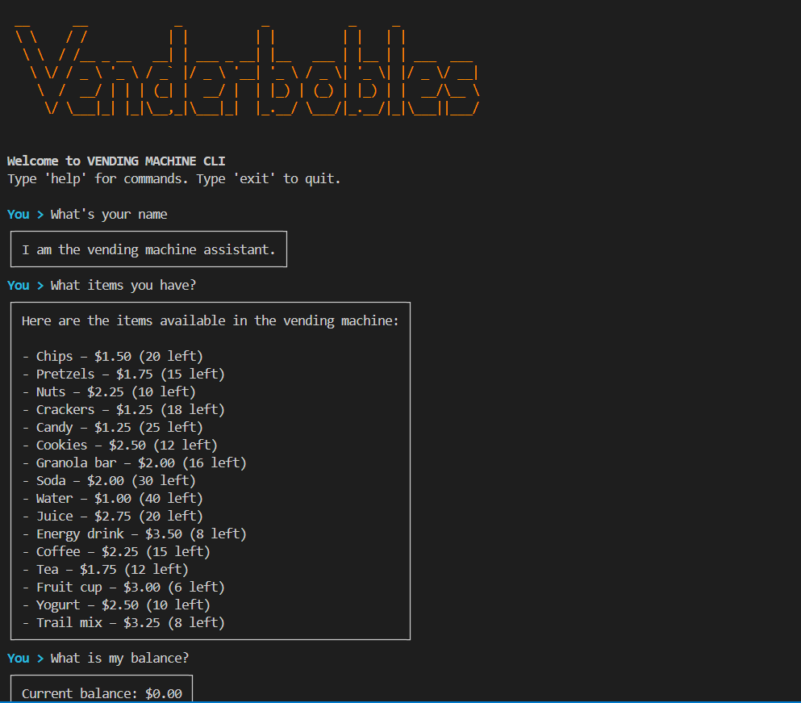

# VendAgent

VendAgent is a simple tool designed to automate and manage vending machine operations. It helps track inventory, sales, and restocking schedules to streamline vending business processes.

## Features

- Inventory management
- Sales tracking
- Restocking reminders

## Getting Started

Clone the repository and follow the setup instructions in the documentation to begin using VendAgent.
